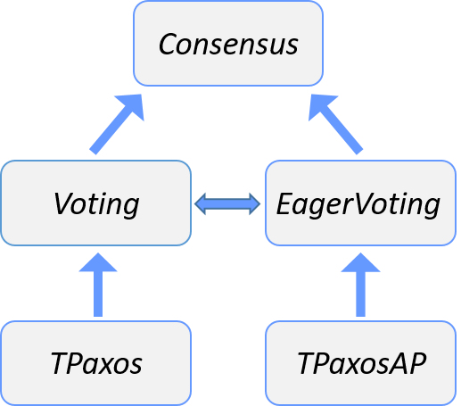

# Paxosstore-tla

A project of using [TLA+](http://lamport.azurewebsites.net/tla/tla.html) to model check the correctness of the consensus algorithm in the [PaxosStore@VLDB2017](http://www.vldb.org/pvldb/vol10/p1730-lin.pdf) paper and the open-source [Tencent/paxosstore](https://github.com/Tencent/paxosstore).

### TLA+ module

While constructing specification of the consensus algorithm TPaxos in PaxosStore, we uncover a crucial but sutble detail in TPaxos which is not fully clarified, called TPaxosAP. We verify the correctness of both TPaxos and TPaxosAP, and  establish the refinement mappings from TPaxos to Voting and from TPaxosAP to EagerVoting(equivalent to Voting).

#### Module

- TPaxos.tla: the specification of the TPaxos.
- TPaxosAP.tla: the specification of the variant of TPaxos.
- TPaxosWithVotes.tla: the refinement mapping of TPaxos refining Voting.
- TPaxosAPWithVotes.tla: the refinement mapping of TPaxosAP refining EagerVoting.
- EagerVoting.tla: a specification that is equivalent to Voting.  
- Voting.tla: a specification introduce by Lamport in paper [Byzanting Paxos by Refinement](http://lamport.azurewebsites.net/pubs/web-byzpaxos.pdf).
- Consensus.tla: a specification that implemented by Voting.

#### Refinement relation

### Model checking with TLC

The experiment refers to [TPaxosExperiment](https://github.com/Starydark/TPaxosExperiment).

 