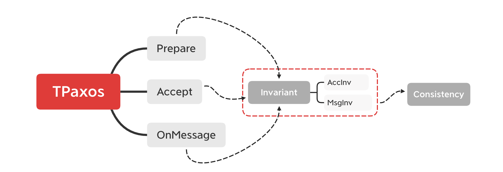

## TLA+ Module

#### Module

- [TPaxos.tla](./TPaxos.tla): the specification and proof of the TPaxos.
- [Paxos.tla](./Paxos.tla): the specification and proof of the Paxos.
- [EagerVoting.tla](./EagerVoting.tla): a specification wit h proof that is equivalent to Voting.  
- [Voting.tla](./Voting.tla): a specification introduced by Lamport in paper [Byzantizing Paxos by Refinement](http://lamport.azurewebsites.net/pubs/web-byzpaxos.pdf).
- [Consensus.tla](./Consensus.tla): a specification that implemented by Voting.

#### Theorem Proving of TPaxos

We introduce a invariant that all actions of TPaxos will remain, which constarin all messages and the state of variables in TPaxos.
